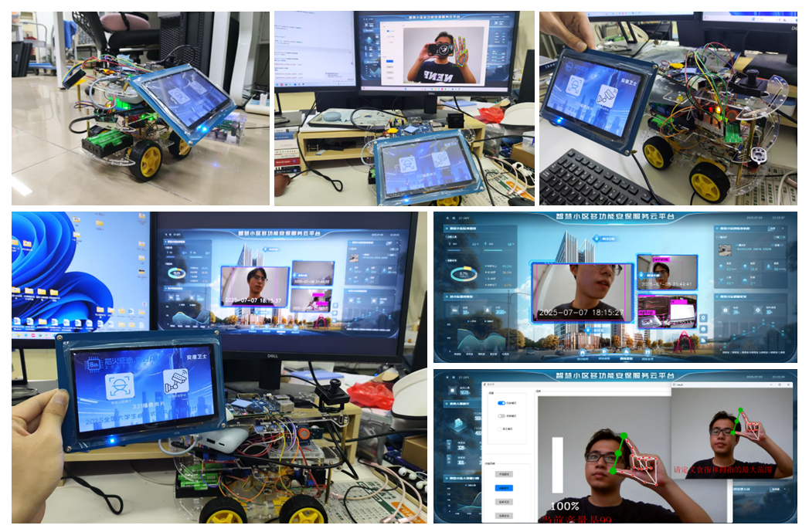
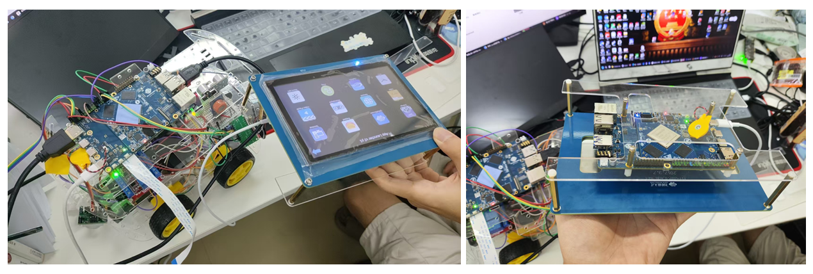

# 基于YOLO11的智慧小区多功能安保服务机器人

[](https://opensource.org/licenses/MIT)
[](https://www.arm.com/)
[](https://github.com/ultralytics/ultralytics)

一个基于深度学习的嵌入式安防系统，集成了人脸识别通行和智能监控功能，采用LVGL图形界面和RKNN神经网络推理引擎，专为ARM64嵌入式设备设计。

## 🚀 项目特色

- **🎯 双核心功能**: 智能人脸通行 + AI安防监控
- **🧠 深度学习**: 基于YOLO11s的目标检测和人脸识别
- **⚡ 硬件加速**: 瑞芯微RKNN推理引擎，高效AI推理
- **🖥️ 现代界面**: LVGL图形库，支持触摸屏交互
- **📹 实时视频**: FFmpeg进行硬件编码，实现RTSP推流
- **🔊 智能提醒**: 音频报警系统
- **📱 多显示支持**: 支持HDMI、LCD触摸屏显示

## 🖥️项目图片



### 😎ELF2开发板外壳

自主设计面板外壳，嘉立创开源，连接ELF2开发板和7寸LCD，方便开发者使用，避免磕碰



## 📋 系统架构

```
                     智慧安防系统总体架构
    ┌─────────────────────────────────────────────────────────────┐
    │                    应用层 (Application Layer)                │
    │  ┌─────────────┐  ┌─────────────┐  ┌─────────────┐          │
    │  │  主页面      │  │  门禁页面    │  │  监控页面    │          │
    │  │ MainPage    │  │AccessControl│  │SecurityCamera│          │
    │  └─────────────┘  └─────────────┘  └─────────────┘          │
    │                          │                                   │
    │                   ┌─────────────┐                           │
    │                   │  页面管理器  │                           │
    │                   │ PageManager │                           │
    │                   └─────────────┘                           │
    └─────────────────────────────────────────────────────────────┘
                               │
    ┌─────────────────────────────────────────────────────────────┐
    │                   中间件层 (Middleware Layer)                │
    │                                                             │
    │  ┌─────────────────┐              ┌─────────────────┐      │
    │  │   AI推理引擎     │              │   视频处理引擎   │      │
    │  │  ┌───────────┐  │              │  ┌───────────┐  │      │
    │  │  │人脸识别池  │  │              │  │硬件编码器  │  │      │
    │  │  │FaceRknn   │  │ ◄─────────── │  │h264_rkmpp │  │      │
    │  │  │Pool       │  │              │  └───────────┘  │      │
    │  │  └───────────┘  │              │  ┌───────────┐  │      │
    │  │  ┌───────────┐  │              │  │RTSP推流   │  │      │
    │  │  │安防检测池  │  │              │  │MediaMTX   │  │      │
    │  │  │SecurityRknn│ │              │  └───────────┘  │      │
    │  │  │Pool       │  │              │  ┌───────────┐  │      │
    │  │  └───────────┘  │              │  │本地录像   │  │      │
    │  └─────────────────┘              │  │MP4存储    │  │      │
    │           │                       │  └───────────┘  │      │
    │  ┌─────────────────┐              └─────────────────┘      │
    │  │   图像预处理     │                       │               │
    │  │  ┌───────────┐  │                       │               │
    │  │  │格式转换   │  │ ◄─────────────────────┘               │
    │  │  │尺寸调整   │  │                                       │
    │  │  │颜色空间   │  │                                       │
    │  │  └───────────┘  │                                       │
    │  └─────────────────┘                                       │
    │                                                             │
    │  ┌─────────────────┐              ┌─────────────────┐      │
    │  │   界面渲染引擎   │              │   音频报警系统   │      │
    │  │  ┌───────────┐  │              │  ┌───────────┐  │      │
    │  │  │LVGL核心   │  │              │  │语音提示   │  │      │
    │  │  │图形库     │  │              │  │PulseAudio │  │      │
    │  │  └───────────┘  │              │  └───────────┘  │      │
    │  │  ┌───────────┐  │              │  ┌───────────┐  │      │
    │  │  │触摸事件   │  │              │  │报警音效   │  │      │
    │  │  │EVDEV处理  │  │              │  │异常提醒   │  │      │
    │  │  └───────────┘  │              │  └───────────┘  │      │
    │  └─────────────────┘              └─────────────────┘      │
    └─────────────────────────────────────────────────────────────┘
                               │
    ┌─────────────────────────────────────────────────────────────┐
    │                   系统层 (System Layer)                     │
    │                                                             │
    │  ┌─────────────────┐              ┌─────────────────┐      │
    │  │   显示驱动       │              │   输入设备驱动   │      │
    │  │  ┌───────────┐  │              │  ┌───────────┐  │      │
    │  │  │DRM显示    │  │              │  │触摸屏驱动  │  │      │
    │  │  │直接渲染   │  │              │  │EVDEV接口  │  │      │
    │  │  └───────────┘  │              │  └───────────┘  │      │
    │  └─────────────────┘              └─────────────────┘      │
    │                                                             │
    │  ┌─────────────────┐              ┌─────────────────┐      │
    │  │   视频采集驱动   │              │   GPIO控制驱动   │      │
    │  │  ┌───────────┐  │              │  ┌───────────┐  │      │
    │  │  │V4L2接口   │  │              │  │门禁控制   │  │      │
    │  │  │摄像头驱动  │  │              │  │传感器读取  │  │      │
    │  │  └───────────┘  │              │  └───────────┘  │      │
    │  └─────────────────┘              └─────────────────┘      │
    └─────────────────────────────────────────────────────────────┘
                               │
    ┌─────────────────────────────────────────────────────────────┐
    │                   硬件层 (Hardware Layer)                   │
    │                                                             │
    │  ┌─────────────────┐              ┌─────────────────┐      │
    │  │   RK3588主控     │              │   外设接口       │      │
    │  │  ┌───────────┐  │              │  ┌───────────┐  │      │
    │  │  │CPU四核A76 │  │              │  │USB摄像头  │  │      │
    │  │  │四核A55    │  │              │  │MIPI-CSI   │  │      │
    │  │  └───────────┘  │              │  └───────────┘  │      │
    │  │  ┌───────────┐  │              │  ┌───────────┐  │      │
    │  │  │NPU 6TOPS  │  │              │  │触摸屏显示  │  │      │
    │  │  │AI加速     │  │              │  │MIPI-DSI   │  │      │
    │  │  └───────────┘  │              │  └───────────┘  │      │
    │  │  ┌───────────┐  │              │  ┌───────────┐  │      │
    │  │  │GPU Mali   │  │              │  │人体传感器  │  │      │
    │  │  │图形渲染   │  │              │  │SR501      │  │      │
    │  │  └───────────┘  │              │  └───────────┘  │      │
    │  └─────────────────┘              └─────────────────┘      │
    └─────────────────────────────────────────────────────────────┘
```

## 🛠️ 核心技术栈

### AI 推理框架
- **RKNN**: 瑞芯微神经网络推理引擎
- **YOLO11s**: 轻量级目标检测模型
- **RetinaFace**: 高精度人脸检测
- **FaceNet**: 人脸特征提取与识别

### 图形界面
- **LVGL**: 轻量级嵌入式图形库
- **多后端支持**: Framebuffer、DRM、Wayland
- **触摸支持**: evdev输入设备

### 视频处理
- **FFmpeg**: 视频编解码
- **硬件编码**: RK3588 H.264编码器
- **OpenCV**: 图像处理
- **RTSP**: 实时流媒体协议

## 📦 主要功能

### 1. 智能人脸通行
实时人脸检测与识别系统，基于RetinaFace和FaceNet算法实现高精度人脸识别。支持GPIO控制电子锁，具备完整的人员进出日志记录和语音提示功能，为智慧小区提供安全可靠的通行管理解决方案。

### 2. AI安防监控站  
基于YOLO11s的智能监控系统，能够实时检测人员、车辆等目标对象。支持多路摄像头监控、RTSP推流、自动录像存储和异常行为检测报警，为小区安防提供全方位的智能监控服务。

## 🔧 硬件要求

### 开发板平台
- **主控板**: ELF2 开发板
- **处理器**: RK3588 八核ARM架构 (4×Cortex-A76 + 4×Cortex-A55)

### 外设要求
- **显示**: 支持HDMI 4K输出或MIPI-DSI触摸屏
- **摄像头**: UVC 摄像头
- **音频**: 蓝牙音响
- **扩展**: GPIO接口用于通行控制 OLED 显示屏和 HC-SR501 人体红外感应模块等等。

## 📥 安装指南

### 1. 系统依赖

```bash
sudo apt update

# LVGL 是 lv_port_linux 的子模块，使用以下命令获取它，它会被下载到 lvgl/ 目录下
git submodule update --init --recursive

# 安装基础依赖
sudo apt install -y build-essential cmake git pkg-config

# 安装图形和多媒体库
sudo apt install -y libgpiod-dev libopencv-dev libavcodec-dev libavformat-dev libavfilter-dev

# 安装音频库
sudo apt install -y libasound2-dev pulseaudio

# 安装工具
sudo apt install -y evtest gsoap libdrm-tests
```

### 2. 编译项目

```bash
# 克隆项目
git clone https://github.com/tao2624/security_service_system.git
cd security_service_system

# 创建构建目录
mkdir build && cd build

# 配置CMake
cmake ..

# 编译
make -j$(nproc)
```

### 3. 模型文件

请将AI模型文件放置在以下目录：
```
src/assets/model/
├── retina_face.rknn      # 人脸检测模型
├── facenet.rknn          # 人脸识别模型
├── yolo11s.rknn          # 目标检测模型
└── coco_80_labels_list.txt # YOLO标签文件
```

## :information_source: 使用说明

### 1. 运行说明

```bash
# 基本运行（需要root权限操作GPIO）
sudo ./lvglsim

# 指定显示设备
sudo LV_LINUX_DRM_CARD=/dev/dri/card0 ./lvglsim

# 指定输入设备
sudo LV_LINUX_EVDEV_POINTER_DEVICE=/dev/input/event7 ./lvglsim
```

### 2. 配置参数

#### 显示配置
```bash
# 查看显示连接器
modetest -M rockchip -c

# 设置连接器ID（在代码中修改）
# 对于HDMI: connector_id = 通常为较小数值
# 对于LCD: connector_id = 448 (示例)
```

#### 音频配置
```bash
# 查看音频设备
pactl list short sinks

# 测试音频播放
paplay /path/to/audio/file.wav

# 蓝牙音响播放
paplay --device=bluez_sink.XX_XX_XX_XX_XX_XX.a2dp_sink /path/to/audio/file.wav
```

#### 摄像头配置
```bash
# 查看可用摄像头
ls /dev/video*

# 测试摄像头
ffplay /dev/video0
```

### 3. RTSP服务器设置

使用MediaMTX作为RTSP服务器：

```bash
# 下载MediaMTX
wget https://github.com/bluenviron/mediamtx/releases/download/v1.2.0/mediamtx_v1.2.0_linux_arm64v8.tar.gz
tar -xzf mediamtx_v1.2.0_linux_arm64v8.tar.gz

# 启动RTSP服务器
./mediamtx

# 在另一个终端观看推流
ffplay rtsp://localhost:8554/live/stream
```

## :exclamation: 常见问题

### 1. 编译问题

**问题**: `libavcodec.so版本冲突警告`
```bash
/usr/bin/ld: warning: libavcodec.so.58 may conflict with libavcodec.so.60
```
**解决**: 这是警告不是错误，不影响程序的正常运行。

### 2. 权限问题

**问题**: `Permission denied` 访问设备文件
**解决**: 

```bash
# 添加用户到相关组
sudo usermod -a -G video,audio,input,gpio $USER

# 或使用sudo运行
sudo ./lvglsim
```

### 3. 显示问题

**问题**: 屏幕显示异常或无法显示
**解决**:

```bash
# 重启图形服务
sudo systemctl restart gdm3

# 检查DRM设备
ls -la /dev/dri/

# 查看验证connector_id
modetest -M rockchip -c
```

### 4. 摄像头问题

**问题**: 人脸识别框错位
**解决**: 确保摄像头分辨率设置正确，在代码中修改`CAMERA_WIDTH`和`CAMERA_HEIGHT`为摄像头支持的分辨率。

### 5. 音频问题

**问题**: root用户无法播放音频
**解决**: 使用指定用户运行音频命令：

```bash
sudo -u $USER env XDG_RUNTIME_DIR=/run/user/$(id -u $USER) PULSE_SERVER=unix:/run/user/$(id -u $USER)/pulse/native paplay /path/to/audio.wav
```

## 📁 项目结构

```
security_service_system/
├── CMakeLists.txt              # CMake构建配置
├── README.md                   # 项目说明文档
├── LICENSE              
├── mouse_cursor_icon.c         # 鼠标图标资源
├── assets/                     # 资源文件
│   └── model/                  # AI模型文件
├── src/                        # 源代码目录
│   ├── include/              
│   ├── module/                 # 功能模块
│   └── main.cpp                # 主程序入口
├── lvgl/                       # LVGL图形库
├── build/                      # 构建输出目录
└── bin/                        # 可执行文件目录
```

##  使用的库

- [LVGL](https://lvgl.io/) - 嵌入式图形库
- [FFmpeg](https://ffmpeg.org/) - 多媒体框架
- [OpenCV](https://opencv.org/) - 计算机视觉库
- [RKNN](https://github.com/rockchip-linux/rknn-toolkit2) - 瑞芯微AI推理框架
- [YOLO](https://github.com/ultralytics/ultralytics) - 目标检测算法
- [MediaMTX](https://github.com/bluenviron/mediamtx) - RTSP服务器

---

